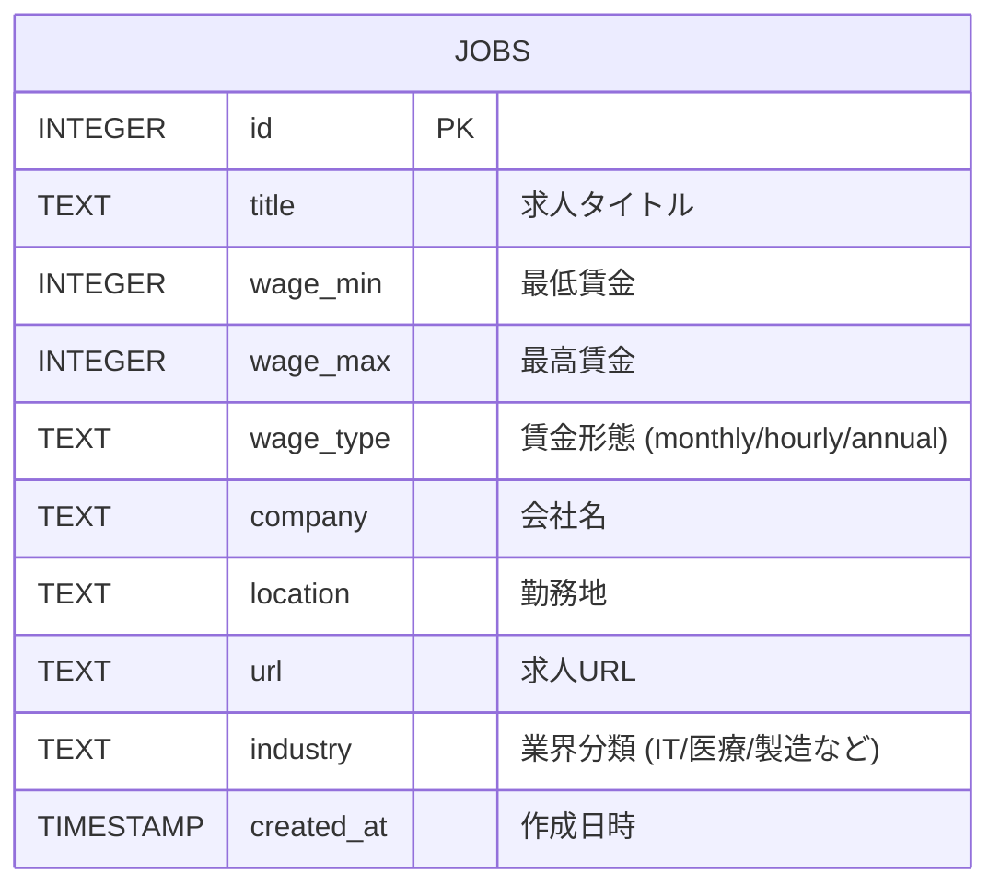
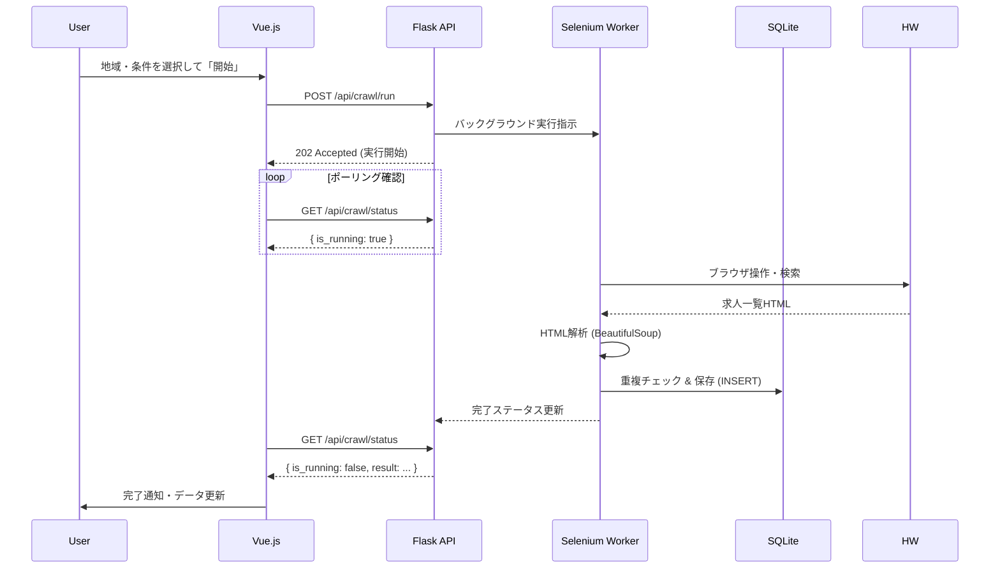

# HelloWork Insight (ハロワ・インサイト)


ハローワークなどの求人情報を収集・分析し、業界トレンドや給与水準を可視化するフルスタック Web アプリケーションです。
Python によるデータ収集・分析バックエンドと、Vue.js によるモダンなフロントエンドを組み合わせて構築されています。

## 🎯 目的

- **トレンド把握**: ハローワーク特有のローカル求人市場の動向を可視化
- **給与分析**: 業界・地域ごとの適正給与を機械学習で予測
- **技術実践**: Flask + Vue.js の実践的なフルスタック開発とリファクタリング

## 🏗 アーキテクチャ

### システム構成図

```mermaid
graph TD
    User([ユーザー]) -->|ブラウザ操作| Frontend["Frontend (Vue.js)"]

    subgraph "Frontend Logic"
        UI[UI Components]
        Logic[Composables]
        UI --> Logic
    end

    Frontend -->|REST API (JSON)| Backend["Backend (Flask)"]

    subgraph "Backend Logic"
        API[Blueprints (API Routes)]
        Service[Business Logic]
        Crawler[Selenium Crawler]
        ML[ML Predictor]

        API --> Service
        API --> ML
        API --> Crawler
    end

    Crawler -->|Scraping| HW[ハローワークWeb]
    Service -->|SQL| DB[(SQLite Database)]
    ML -->|Load/Train| DB
    Backend -->|Response| Frontend
```

### データベース設計 (ER 図)



### 処理シーケンス (クローラー実行)



## 🛠 技術スタック

### Backend (Python)

- **Framework**: Flask (Blueprints によるモジュール分割)
- **Database**: SQLite3
- **Scraping**: Selenium, undetected-chromedriver, BeautifulSoup4
- **ML**: scikit-learn (RandomForestRegressor), pandas
- **Testing**: pytest (TDD 実践)
- **Job Scheduler**: APScheduler

### Frontend (JavaScript)

- **Framework**: Vue.js 3 (Composition API)
- **Build Tool**: Vite
- **UI Components**: Scoped CSS Custom Design
- **Visualization**: Chart.js 4 (vue-chartjs)
- **State Management**: Composables (`useJobs`, `useStats`, etc.)

## 📂 ディレクトリ構成

```plaintext
hellowork_insight/
├── backend/                 # Python バックエンド
│   ├── app.py              # アプリケーションエントリーポイント
│   ├── routes/             # APIエンドポイント (Blueprint)
│   │   ├── jobs.py         # 求人管理
│   │   ├── analysis.py     # 分析・統計
│   │   ├── crawler.py      # クローラー制御
│   │   └── ml.py           # 機械学習
│   ├── crawler.py          # ハローワーククローラー本体
│   ├── database.py         # データベース操作
│   ├── ml_predictor.py     # 給与予測モデル
│   ├── jobs.db             # SQLiteデータベース
│   └── test/               # ユニットテスト
└── frontend/               # Vue.js フロントエンド
    ├── src/
    │   ├── components/     # UIコンポーネント (Dashboard, JobSearch...)
    │   ├── composables/    # ビジネスロジック (useJobs, useStats...)
    │   └── App.vue         # メインアプリケーション
    └── package.json
```

## 🚀 実行方法

### 1. Backend (API サーバー)

```bash
cd backend
python3 -m venv .venv
source .venv/bin/activate
pip install -r requirements.txt
python3 app.py
# http://127.0.0.1:5000 でAPIサーバーが起動
```

### 2. Frontend (UI)

```bash
cd frontend
npm install
npm run dev
# http://localhost:5173 でアプリケーションが起動
```

## ✅ 機能一覧

- [x] **求人検索**: 地域・業界・給与によるフィルタリング検索
- [x] **ダッシュボード**: 業界別・地域別の求人数・給与統計グラフ
- [x] **自動クローラー**: ハローワーク/Indeed からの定期データ収集
- [x] **AI 給与予測**: 業界・地域・雇用形態から適正給与を予測 (Random Forest)
- [x] **業界トレンド**: ホットな業界のヒートマップ表示

## 🚧 今後のロードマップ

- **データクレンジング**: 時給/月給の混在データの更なる正規化
- **詳細分析**: 「リモート可」「未経験 OK」などのタグ抽出と分析
- **認証機能**: ユーザーログインと検索条件の保存
- **デプロイ**: クラウド環境 (AWS/Render) へのデプロイ
